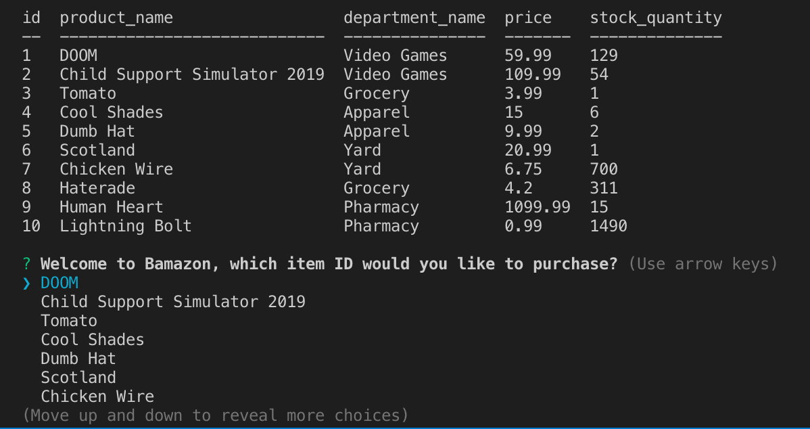
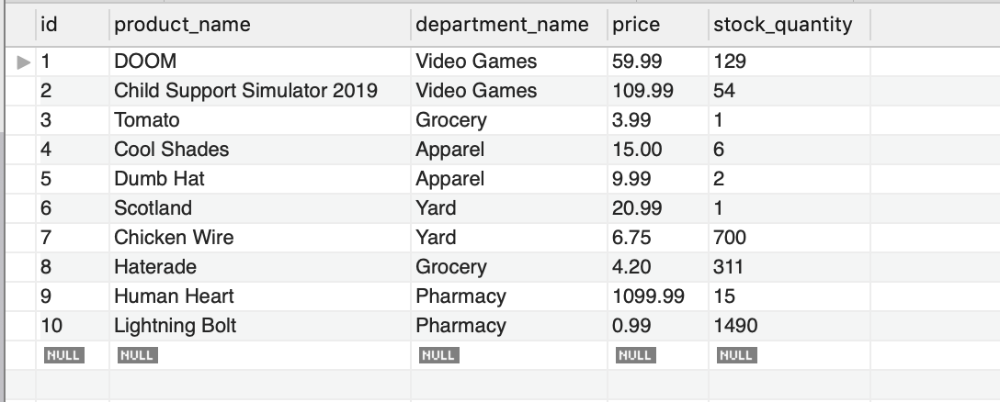
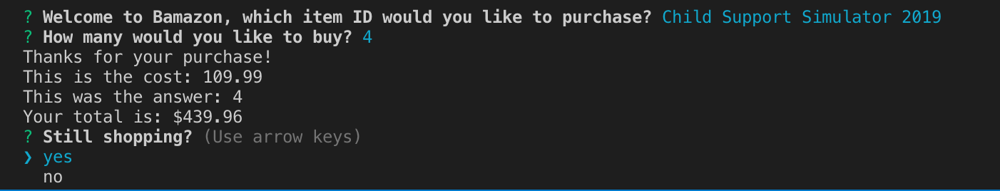
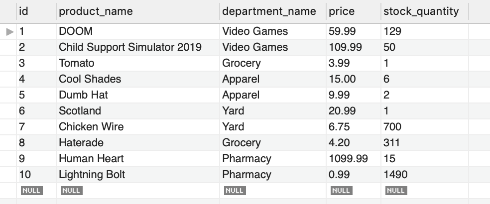

# bamazon

Welcome to Bamazon, whatchya havin?

In my Bamazon App, I've got a store of 10 items from a MySQL database that a user can interact with in the command line. When the user makes a purchase, the SQL database updates with the correct new stock, and the command line returns the price of the items purchased.

The CLI uses the inquirer package to make sure that the user can interact with the store. The sql package is installed as well to make sure a connection is truly made between the program and the database to update new stock values.

The most difficult part of this application to me was the passing the data of the user choice from the inquirer mod. I achieved this by using the question name to pass the user's choice as the data. I used the ChoiceArr in my cost algorithm which wasn't necessary, as only the first question uses an array.

